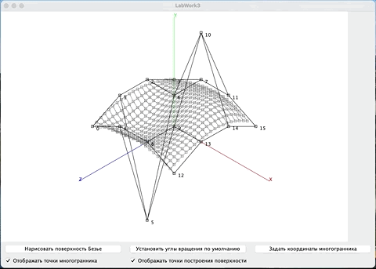
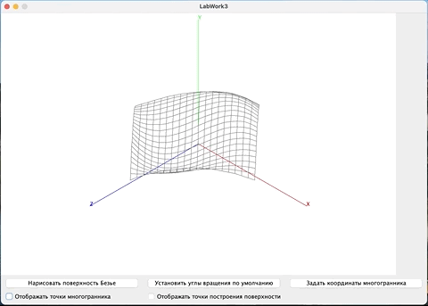

ComputerGraphicsLabWork3
========================

Задание на лабораторную работу 3:

Сформировать поверхность Безье для различного задающего многогранника.
Обеспечить поворот сформированной поверхности вокруг осей X и Y.

Демонстрация работы:

